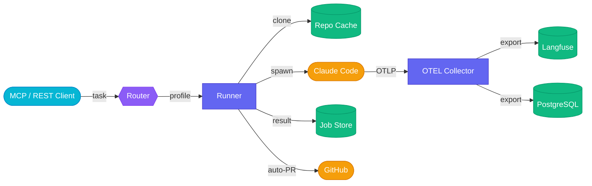

# Run Claude Code at scale. Orchestrate everything.
{: .fs-9 .fw-700 .text-center .mb-4 }

Agenticore manages the full job lifecycle — repo cloning, profile-based execution, auto-PR creation, and OTEL observability — so you can fire tasks and walk away.
{: .fs-5 .text-center .text-grey-dk-100 .mb-6 }

{: .d-block .mx-auto .mb-6 }

<div class="hero-actions text-center mb-8" markdown="0">
  <a href="#quick-start" class="btn btn-primary fs-5 mr-2">Get Started</a>
  <a href="https://github.com/The-Cloud-Clock-Work/agenticore" class="btn fs-5" target="_blank">View on GitHub</a>
</div>

[](https://pypi.org/project/agenticore/)
[](https://github.com/The-Cloud-Clock-Work/agenticore/blob/main/LICENSE)
[](https://github.com/The-Cloud-Clock-Work/agenticore/actions/workflows/test.yml)
[](https://hub.docker.com/r/tccw/agenticore)
[](https://python.org)
{: .text-center .mb-8 }

---

## The Problem

You want Claude Code to run tasks in the background — clone repos, write code, open PRs — without babysitting a terminal. But there's no orchestration layer. No profiles, no job tracking, no observability.

**Agenticore fixes this.**

It takes a task, clones the repo, runs Claude Code with the right profile, streams telemetry to your observability stack, and opens a PR when done. Fire and forget.

---

## Features

<div class="feature-grid">
  <div class="feature-card">
    
    <h3>Job Orchestration</h3>
    <p>Submit tasks via MCP or REST. Agenticore clones the repo, spawns Claude Code, tracks the job, and reports results — all async.</p>
  </div>
  <div class="feature-card">
    
    <h3>Profile System</h3>
    <p>Predefined execution profiles (code, review) control model, permissions, timeouts, and auto-PR behavior. Extend or create your own.</p>
  </div>
  <div class="feature-card">
    
    <h3>OTEL Telemetry</h3>
    <p>Full observability pipeline. Claude's native OTEL support feeds into your collector, exporting to Langfuse and PostgreSQL.</p>
  </div>
  <div class="feature-card">
    
    <h3>Auto-PR Creation</h3>
    <p>When a coding job succeeds, Agenticore pushes the branch and opens a PR automatically. No manual steps required.</p>
  </div>
</div>

---

## How It Works

```
Request (MCP or REST)
  │
  ├─ Router selects profile
  ├─ Clone/fetch repo (flock-protected cache)
  ├─ Spawn: claude --worktree -p "task" (with profile flags + OTEL env)
  ├─ Collect telemetry → OTEL Collector → Langfuse + PostgreSQL
  ├─ Ship Claude session transcript → Langfuse (via SDK)
  ├─ Auto-PR on success (when profile enables it)
  └─ Job result → Redis (or file fallback)
```

1. **Takes a task** via MCP tool or REST API
2. **Clones the repo** into a cached directory (flock-serialized, reuses on subsequent runs)
3. **Runs Claude Code** as a subprocess with profile-derived CLI flags and OTEL environment
4. **Streams telemetry** through Claude's native OTEL support to a collector
5. **Ships transcripts** from the Claude session to Langfuse as spans
6. **Creates a PR** automatically if the profile has `auto_pr: true` and the job succeeds

---

## Quick Start
{: #quick-start }

```bash
pip install agenticore
AGENTICORE_TRANSPORT=sse agenticore serve
curl http://localhost:8200/health
```

Or with Docker Compose:

```bash
cp .env.example .env
docker compose up --build -d
```

This starts agenticore, Redis, PostgreSQL, and an OTEL Collector — all wired together.

Add to your MCP config (`~/.mcp.json`):

```json
{
  "mcpServers": {
    "agenticore": {
      "url": "http://localhost:8200/mcp"
    }
  }
}
```

{: .note }
> Zero external dependencies to start — file-based job storage out of the box. Add Redis for caching and the OTEL Collector for observability when you need them.

---

## 5 MCP Tools

| Tool | What it does |
|:-----|:-------------|
| `run_task` | Submit a task (async by default, `wait=true` to block) |
| `get_job` | Get job status, output, artifacts, and PR URL |
| `list_jobs` | List recent jobs with status |
| `cancel_job` | Cancel a running job |
| `list_profiles` | List available execution profiles |

---

## REST API

```bash
# Submit a job (async — returns job ID immediately)
curl -X POST http://localhost:8200/jobs \
  -H "Content-Type: application/json" \
  -d '{"task": "fix the auth bug", "repo_url": "https://github.com/org/repo"}'

# Check status
curl http://localhost:8200/jobs/{job_id}

# List jobs
curl http://localhost:8200/jobs

# Cancel
curl -X DELETE http://localhost:8200/jobs/{job_id}

# List profiles
curl http://localhost:8200/profiles
```

---

## Architecture



---

## Deployment Options

| | Minimal | Standard | Production |
|:--|:--------|:---------|:-----------|
| **Install** | `pip install agenticore` | `docker compose up -d` | Docker + managed infra |
| **Storage** | File fallback | Redis + file fallback | Redis |
| **Observability** | None | Local OTEL Collector | Langfuse + PostgreSQL |
| **Access** | Local only | Local network | Internet (API key auth) |
| **Auto-PR** | Manual | `GITHUB_TOKEN` set | `GITHUB_TOKEN` + profiles |

---

## FAQ

<details markdown="block">
<summary><strong>Do I need Redis and PostgreSQL?</strong></summary>

No. `pip install agenticore && agenticore serve` works with zero dependencies — file-based job storage out of the box. Add Redis for caching and PostgreSQL + OTEL Collector for observability when you need them.
</details>

<details markdown="block">
<summary><strong>How does auto-PR work?</strong></summary>

When a profile has `auto_pr: true` and the job succeeds, Agenticore pushes the working branch and runs `gh pr create`. You need `GITHUB_TOKEN` set and `gh` CLI available (included in the Docker image).
</details>

<details markdown="block">
<summary><strong>What profiles are included?</strong></summary>

Two defaults: **code** (autonomous coding worker — writes code, commits, auto-PR) and **review** (read-only code reviewer using haiku). Create custom profiles in `~/.agenticore/profiles/` or load them from an agentihooks repo.
</details>

<details markdown="block">
<summary><strong>How does the OTEL pipeline work?</strong></summary>

Claude Code has native OTEL support. Agenticore sets OTEL env vars on the subprocess so telemetry flows to the OTEL Collector, which exports to Langfuse (via OTLP HTTP) and PostgreSQL. Transcripts are also shipped directly to Langfuse via the SDK.
</details>

<details markdown="block">
<summary><strong>Can I use this with any MCP client?</strong></summary>

Yes. Agenticore exposes 5 MCP tools via FastMCP. Use stdio transport for Claude Code CLI or SSE transport for remote clients like claude.ai, ChatGPT, or any MCP-compatible client.
</details>

<details markdown="block">
<summary><strong>Is my data sent anywhere?</strong></summary>

No. Fully self-hosted. Langfuse integration is opt-in (set `LANGFUSE_PUBLIC_KEY` + `LANGFUSE_SECRET_KEY`). Without it, no telemetry leaves your machine.
</details>

---

<div class="text-center mb-4" markdown="0">
  <p class="fs-5 fw-500">Ready to orchestrate Claude Code at scale?</p>
  <code class="fs-4">pip install agenticore</code>
</div>

[Get Started](docs/getting-started/quickstart){: .btn .btn-primary .fs-5 .mr-2 }
[Documentation](docs/){: .btn .fs-5 .mr-2 }
[View on GitHub](https://github.com/The-Cloud-Clock-Work/agenticore){: .btn .fs-5 }
{: .text-center }
